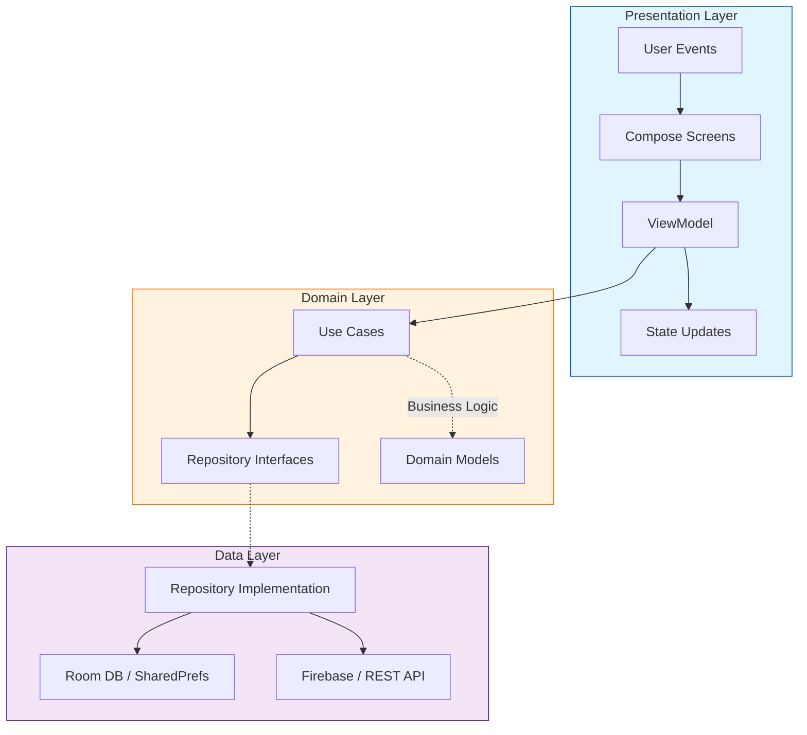
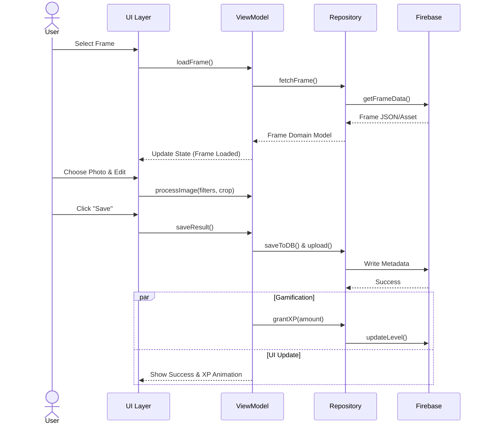

# 📸 Android Photo Frame: Enterprise Ecosystem & Gamification Engine


---

## 📖 Project Overview

**Android Photo Frame** — це професійний Android-застосунок з вертикальною орієнтацією, розроблений для художнього оформлення фотографій. Продукт поєднує в собі потужний редактор колажів із глибокою RPG-системою прогресії та багаторівневою гібридною монетизацією.

🎯 **Основна мета:** перетворити рутинний процес редагування фото на захопливу гру з винагородами.

---

## 🛠 Technical Stack (Senior Level)

| Category | Technologies |
|---|---|
| Language | Kotlin (Coroutines + Flow) |
| UI Framework | Jetpack Compose (Modern declarative UI, Material 3) |
| Architecture | MVVM + Clean Architecture |
| Image Processing | Custom Canvas API + Glide |
| Backend | Firebase (Firestore — прогрес, Storage — асети, Auth) |
| Monetization | AdMob SDK + Google Play Billing Library |
| DI | Hilt / Koin |

---

## 🧠 Core Product Logic & Screen Flow

### 3.1 Navigation Structure

Система навігації побудована на чіткому розділенні етапів редагування та перегляду:

- 🏠 **Home Screen:** Вибір типу колажу (Solo, Couple, Collage)
- 🖼️ **Frame Selector:** Скрол-інтерфейс для вибору рамки (Premium/Free)
- 📂 **Image Picker:** Інтеграція з галереєю для вибору фото
- 🎨 **Editor Space:** Робоча область (gestures, crop, filter)
- 📤 **Share Screen:** Генерація лінку та шеринг результату
- 🏛️ **Gallery:** Архів завершених робіт

---

### 3.2 System Architecture Diagrams

#### 🏗 Component Diagram (MVVM + Clean Architecture)



---

## 🔄 Data Flow Diagram (Image Processing Pipeline)

```mermaid
flowchart LR
    Source["📷 Image Sources"] --> Selector["🖼️ Frame Selector"]
    Selector --> Engine["🎨 Editor Engine"]

    subgraph Engine_Process["Processing"]
        Canvas[Canvas API]
        Matrix[Matrix Ops]
        Filters[Filters]
    end

    Engine --> Engine_Process

    Engine_Process --> Render["💾 Render & Save"]
    Render --> Metadata["📊 Metadata Extractor"]
    Metadata --> Output["🏆 Gamified Output"]

    subgraph Output_Result["Result"]
        XP[+XP Gain]
        Stars[+Star Reward]
        Disk[Save to Disk]
    end

    Output --> Output_Result
```



---

## ⏱️ Sequence Diagram (User Creates & Saves Frame)



---
## 3.3 Database Schema (Firestore)

```mermaid
erDiagram
    USER ||--o{ CREATION : creates
    USER {
        string userId PK
        int level
        int xp
        int stars
        string-array unlockedFrames
        int dailyStreak
    }

    CREATION {
        string creationId PK
        string frameId FK
        string-array imageUrls
        string-array filtersApplied
        timestamp createdAt
        int xpEarned
    }

    FRAME {
        string frameId PK
        string category
        boolean isPremium
        int unlockCost
        string downloadUrl
    }

    QUEST ||--|{ USER : assigned_to
    QUEST {
        string questId PK
        string type
        int xpReward
        int starReward
        json requirements
    }
```   map requirements
    }
---

## 3.4 Editing Capabilities

- ✅ Drag-and-drop  
- ✅ Pinch-to-zoom  
- ✅ Smart Swap (Long Press)  
- ✅ Filter Engine: Brightness, Contrast, Retro, B&W, Cinema  

---

## 🎮 Gamification: The Retention Engine

### 4.1 Experience (XP) System

Прогресія рівнів (макс. **50**). Кожен наступний рівень вимагає на **200 XP** більше.

- **+10 XP** — Створення рамки  
- **+05 XP** — Використання фільтрів  
- **+20 XP** — Шерінг у соцмережах  
- **+50 XP** — Виконання простого квесту  

---

### 4.2 Star Economy (Soft Currency) ⭐

Зірки — валюта для розблокування контенту.

- **Daily Bonus:** 7-денний цикл  
- **Level Up:** +10–25 ⭐  
- **Ads:** +10 ⭐ за Rewarded Video  

---

### 4.3 Daily Bonus & Quests

- **Bonus:** При пропуску дня бонус не скидається (нагорода за "вчора")  
- **Quests:** Щоденні ("Зроби 2 фото") та тематичні ("Альбом подорожі")  

---

## 💰 Monetization Framework (Hybrid Model)

| Method | Logic | UX Impact |
|------|------|-----------|
| Rewarded Ads | 20-сек відео за зірки або преміум-рамку | ✅ User-initiated (Friendly) |
| Interstitials | 5-сек ролики при запуску (чергуються з тріалом) | ⚠️ Обмежена частота |
| Subscription | 4.99 грн/тиждень — No Ads + High-Res | 💎 3-денний Trial |
| Premium Frames | Тимчасовий доступ за 2 рекламних ролики | 🔒 Візуальне маркування |

---

## 🚀 Development Roadmap

**Phase 1 (MVP)**  
Логіка вибору рамок, завантаження фото, drag/zoom, збереження  

**Phase 2 (UX)**  
Полірування UI (Animations), інтеграція фільтрів  

**Phase 3 (Meta)**  
Гейміфікація (XP, рівні), квести, AdMob & Billing  

> **Note:** Реклама ніколи не показується під час активного процесу редагування, щоб не псувати User Experience.

---
